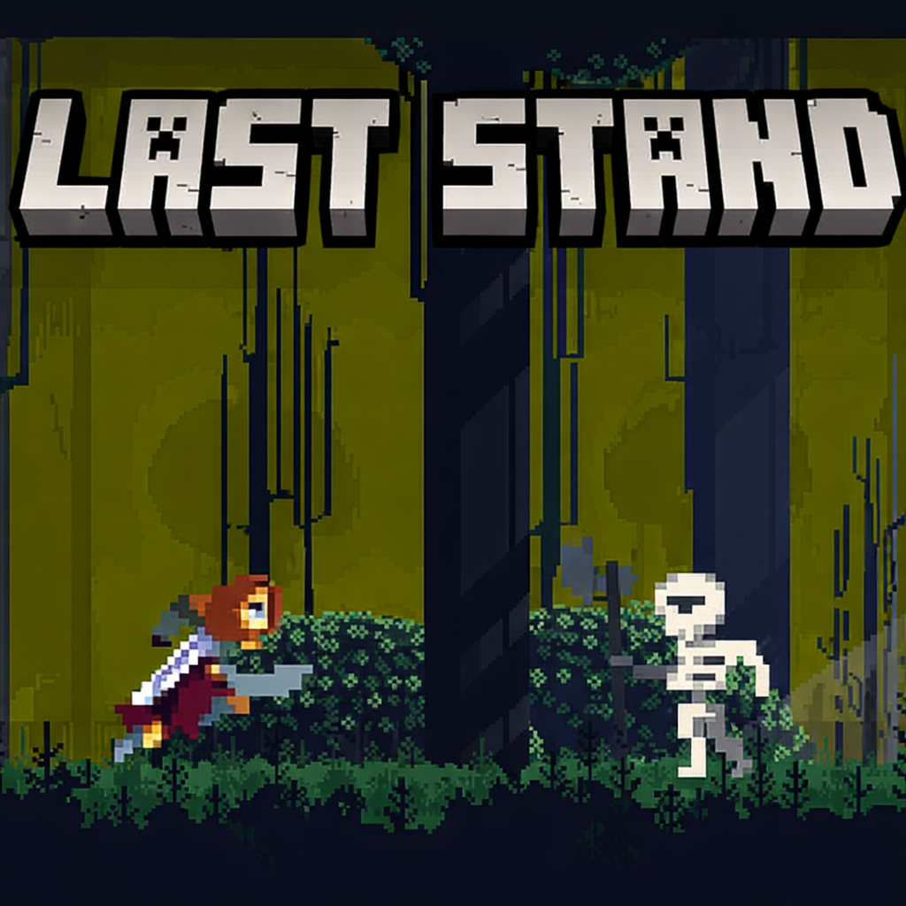
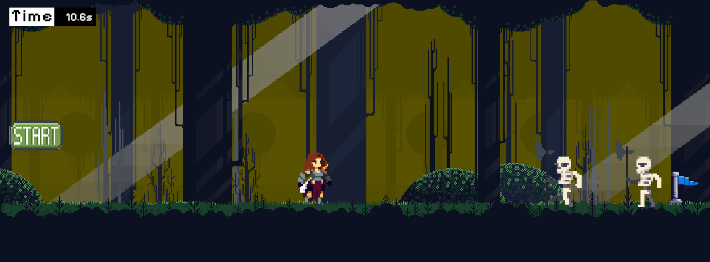
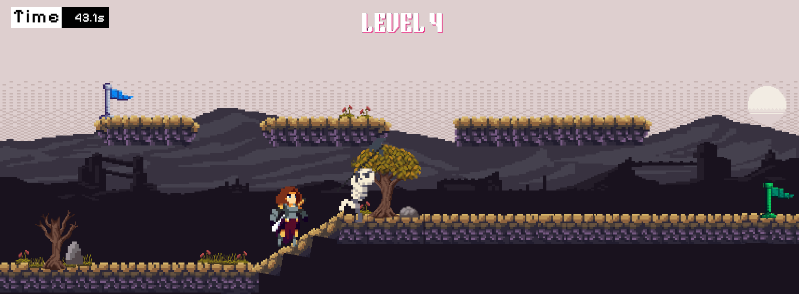

  

# The Last Stand

The Last Stand is a 2D Unity-based action game focused on survival gameplay, combat mechanics, and intense level design.

---

** About the Game

Genre: 2D Action / Survival 

Engine: Unity

Platform: PC

Style: Fast-paced, combat-driven

---

** Features

Player movement and combat system

Enemy behavior and interactions

Health & damage mechanics

Level-based progression

Responsive controls and gameplay feel

---

** Tech Stack

Unity Engine

C#

---

** Purpose of the Project

Learn Unity game mechanics

Implement combat and enemy systems

Practice game logic using C#

Build a complete playable action game

---

** Note

This is an indie learning project

Assets may be placeholders or self-made

Gameplay mechanics may change with improvements

---

## Game images
 
 
 

---
